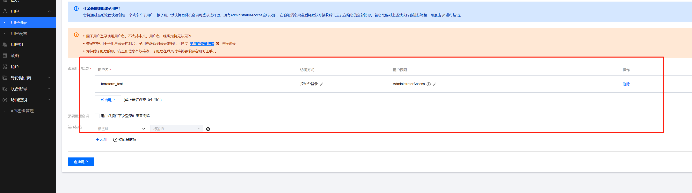
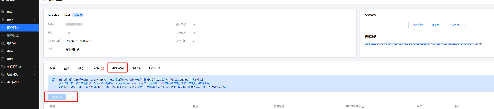
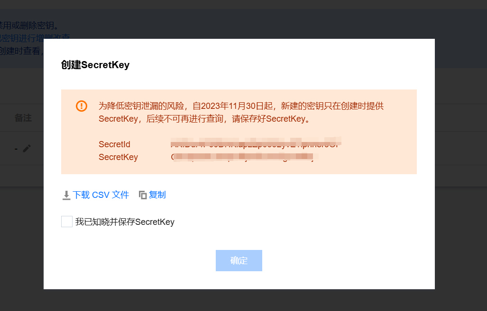
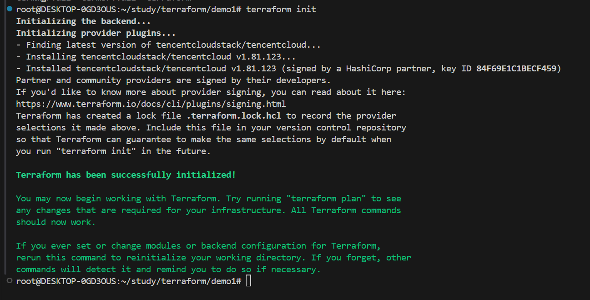
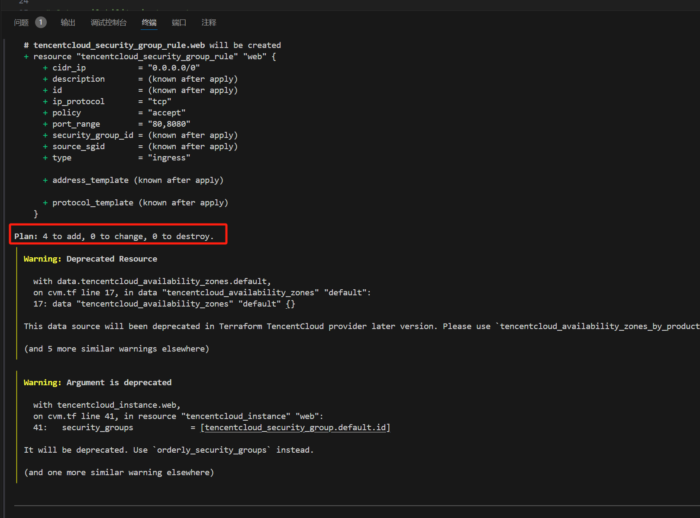
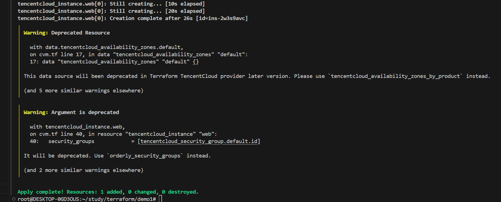
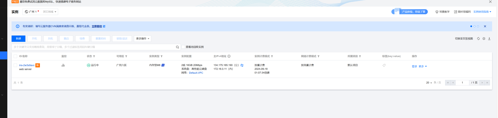
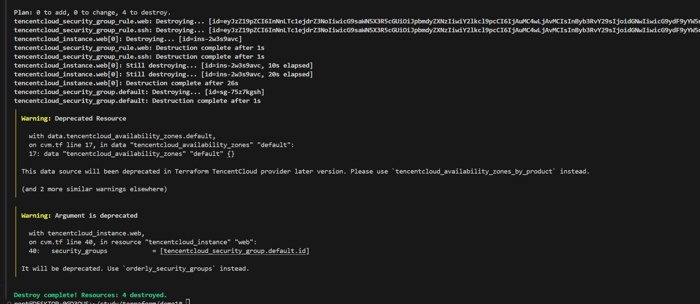

# 开通云服务器

### 1. 操作步骤
- 安装 Terraform • https://developer.hashicorp.com/terraform/downloads 
- 认证配置（腾讯云）
- 开通虚拟机（腾讯云）
- Init, Plan, Apply, Destroy

### 2. 找到Providers
-  Providers地址：Terraform Registry
-  腾讯云的Providers：Docs overview | tencentcloudstack/tencentcloud | Terraform | Terraform Registry

### 3.获取Secret
1. 登录到腾讯云控制台用户列表 - 用户 - 访问管理 - 控制台 (tencent.com)
2. 注册用户
    
3. 获取Secret
-   找到刚才注册的terraform_test用户， 用户 - 控制台 (tencent.com)
-   创建密钥
    

-   复制SecretId、SecretKey
    


### 4.下载腾讯的Provider

1. 使用环境变量填写secret
 ``` shell
$ export TENCENTCLOUD_SECRET_ID="my-secret-id"
$ export TENCENTCLOUD_SECRET_KEY="my-secret-key"
$ export TENCENTCLOUD_REGION="ap-guangzhou"
  ```
2. 执行
 ``` hashicorp
terraform init
  ```


### 5.创建执行计划
 可以查看添加、删除了那些资源等等。
1. 执行
 ``` hashicorp
terraform plan
  ```


### 6.创建资源

1. 执行
 ``` hashicorp
terraform apply -auto-approve
  ```


2. 到控制检查是否创建成功
实例 - 云服务器 - 控制台 (tencent.com)



### 7. 删除资源
 如果不需要使用了，那么就建议删除掉

1. 执行
 ``` hashicorp
terraform destroy -auto-approve
  ```
