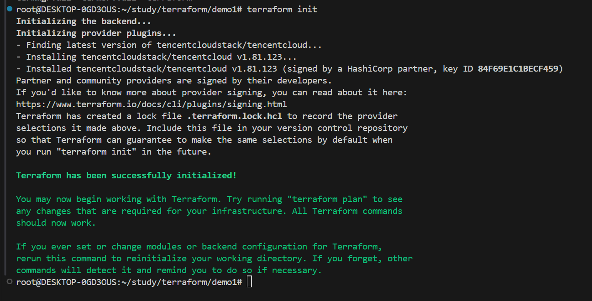
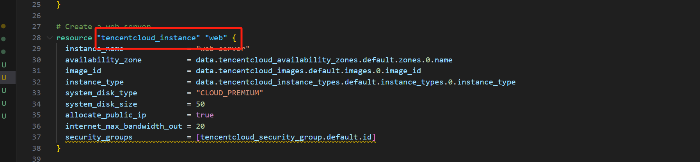
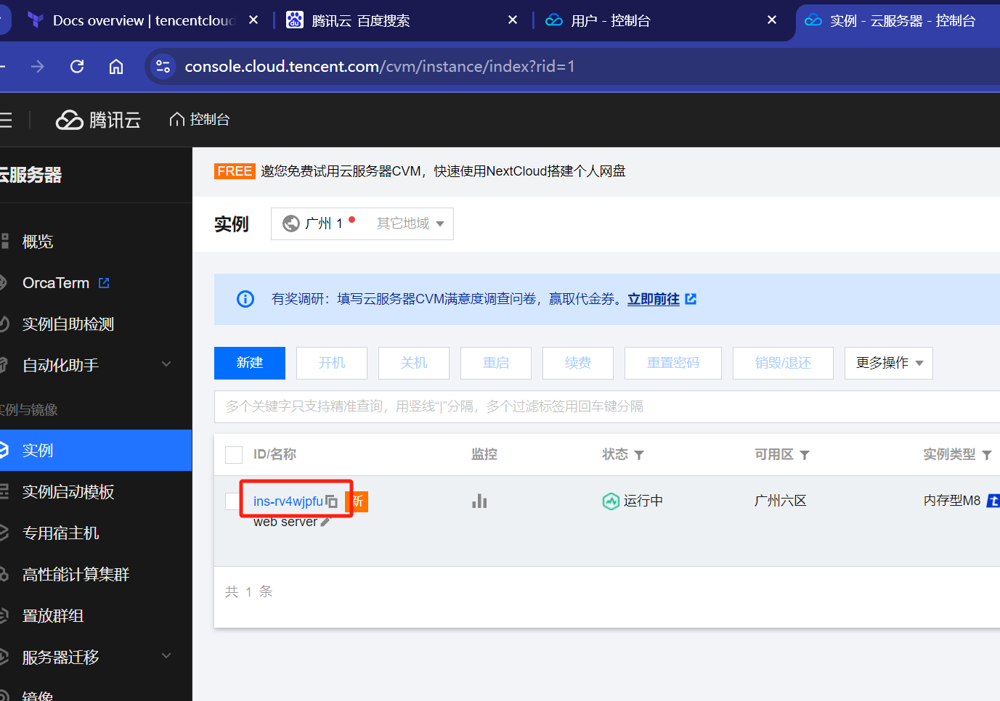
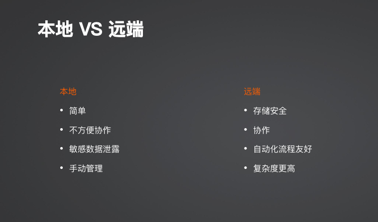
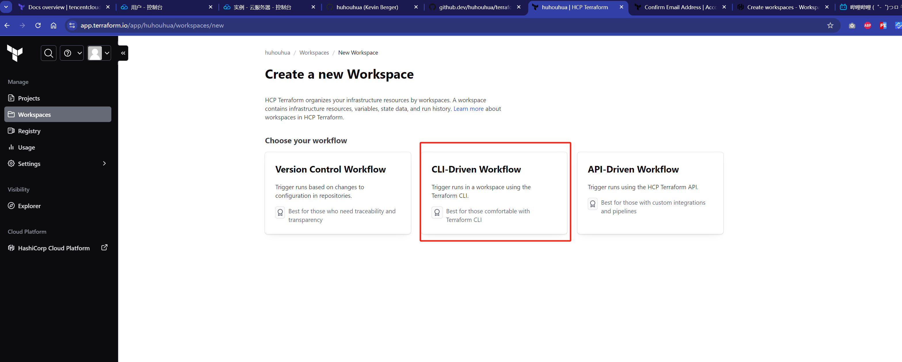
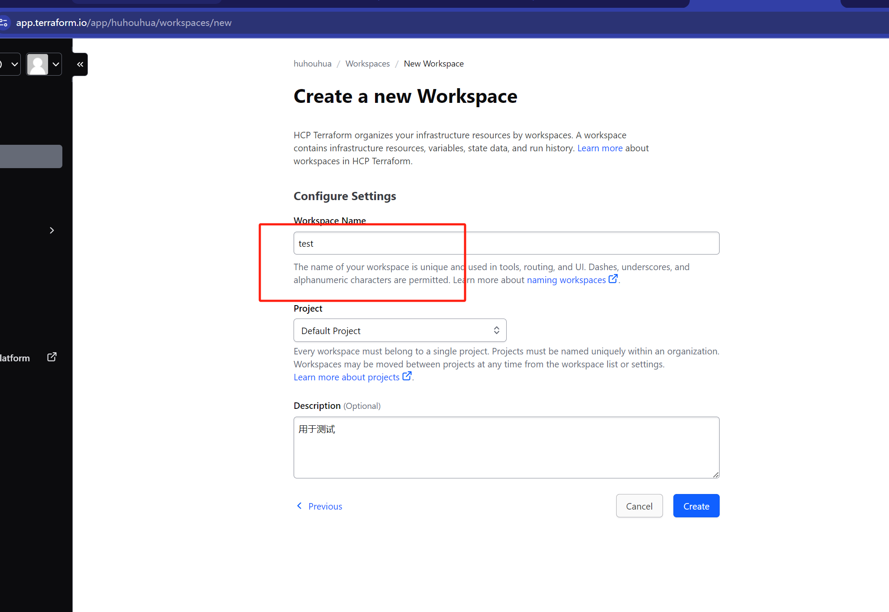
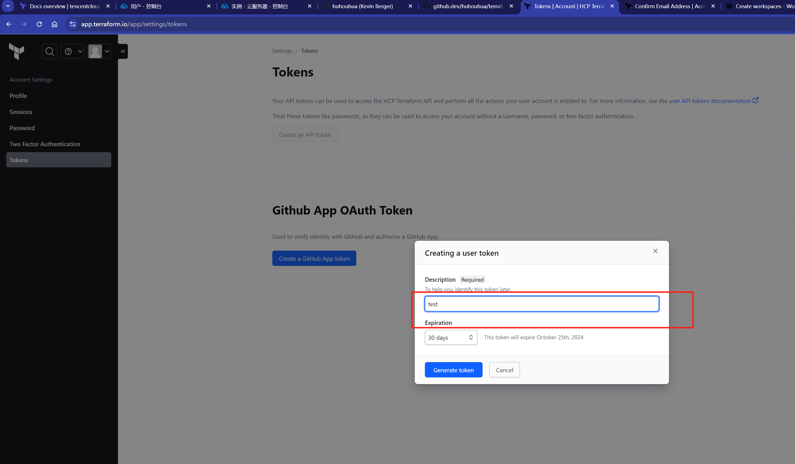
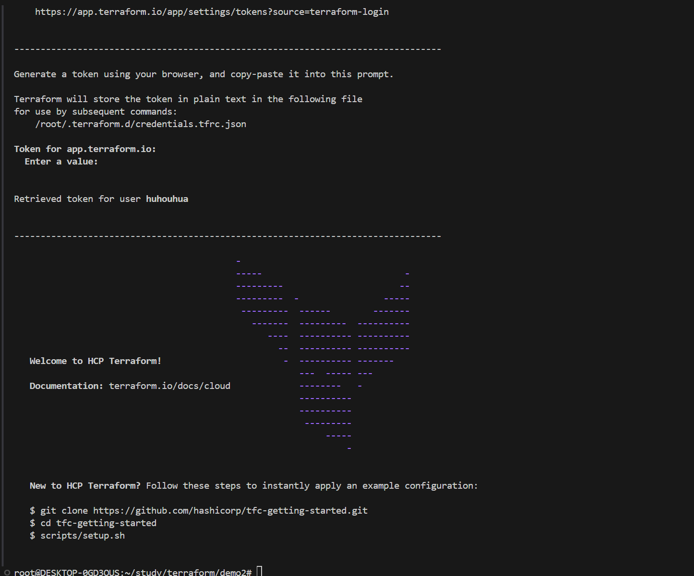

# 导入资源

### 1. 适用场景
- 资源一开始并不是由Terraform创建的
- state状态丢失需要重新拉取真实的状态


### 2.下载腾讯的Provider

1. 使用环境变量填写secret
 ``` shell
$ export TENCENTCLOUD_SECRET_ID="my-secret-id"
$ export TENCENTCLOUD_SECRET_KEY="my-secret-key"
$ export TENCENTCLOUD_REGION="ap-guangzhou"
  ```
2. 下载依赖
 ``` shell
terraform init
  ```


### 3.导入资源
##### 1. 查看需要导入的资源例子
1. 资源类型、名称
 

1. 实例Id(去腾讯云控制台上查看)
  
   
##### 2. 导入
 ``` shell
## 格式
terraform import 资源类型.资源名称 实例id(已存在的)
## 示例
terraform import tencentcloud_instance.web ins-rv4wjpfu
  ```

# Terraform Cloud
- terraform.tfstate： 状态文件，记录了所有的状态，包括敏感信息、如虚拟机密码，建议存储再本地或者远程（非git）。
- 存储方式各自的区别
  


### 1. 创建一个workspace
- 地址: https://app.terraform.io/app
- 具体操作步骤
  
  
  
  
### 2. 创建登录token
  

### 3. 配置cloud
- Terraform backend
``` hashicorp
terraform { 
  cloud {     
    organization = "huhouhua" 
    workspaces { 
      name = "test" 
    } 
  } 
}
```

- AWS backend
``` hashicorp
terraform { 
  backend "s3" {     
     bucket = ""
     key = ""
     region = ""
     dynamodb_table = ""
     encrypt = true
  } 
}
```

- Tencent COS backend
``` hashicorp
terraform { 
  backend "cos" {     
     bucket = ""
     region = ""
     prefix = ""
  } 
}
```


### 3. 登录cloud
``` shell
terraform login
```
  

### 4. 迁移
``` shell
terraform init
```