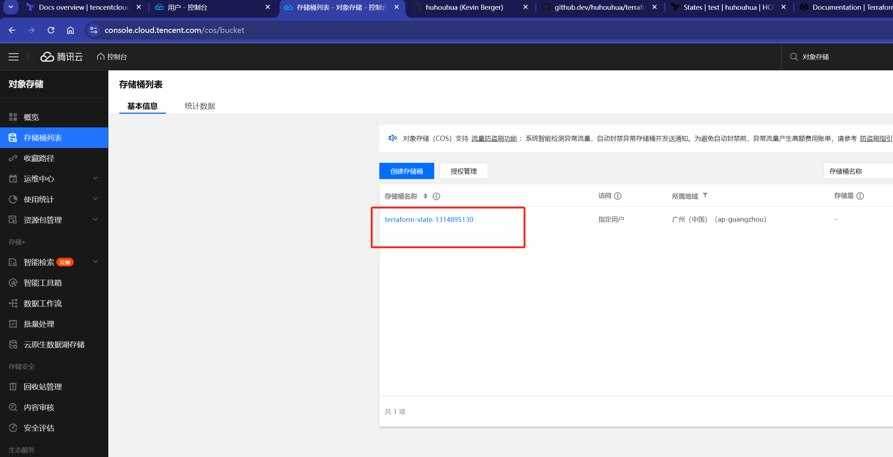
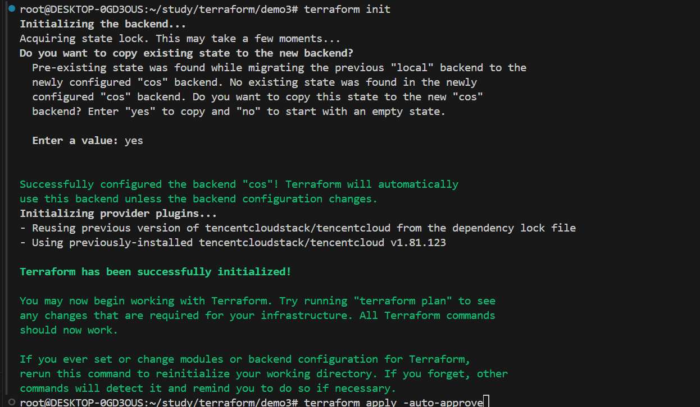

# cos storage from Tencent cloud

### 1.下载腾讯的Provider

1. 使用环境变量填写secret
 ``` shell
$ export TENCENTCLOUD_SECRET_ID="my-secret-id"
$ export TENCENTCLOUD_SECRET_KEY="my-secret-key"
$ export TENCENTCLOUD_REGION="ap-guangzhou"
  ```
2. 下载依赖
 ``` shell
terraform init
  ```


### 2.创建bucket,如果有跳过

1. 创建
 ``` shell
terraform apply -auto-approve
  ```

2. 查看bucket
   


### 3. 配置cos
``` hashicorp
terraform {
  backend "cos" {
    region = "ap-guangzhou"
    bucket = "terraform-state-1314895130"
    prefix = "terraform/state" # 远程存放目录
    encrypt = true
  }
}
```

### 4. 迁移
 ``` shell
terraform init
  ```
   

### 5. 检测是否迁移成功
https://console.cloud.tencent.com/cos/bucket

### 6. state相关命令
- terraform refresh：从基础设施实际状态更新 state 状态
- terraform state list：列出 state 记录的资源
- terraform state rm：删除某些 state 状态
- terraform state pull：从远端拉取状态到本地
- terraform state push：更新本地的状态到远端